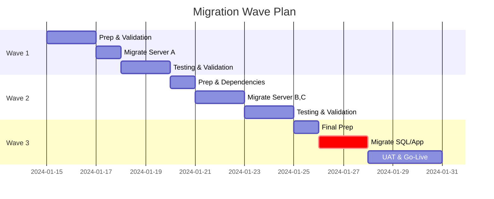

# Challenge 4: Execute

## Challenge Snapshot

| Field | Value |
|---|---|
| Duration | 30 minutes |
| Type | Whiteboard Design Session |
| Points | 15 |
| Deliverable | Migration runbook outline with sequencing and rollback strategy |

## Objective

Design a detailed migration execution strategy including tool selection, sequencing, and rollback planning based on your assessment findings.

---

## The Business Challenge

Contoso's CTO has reviewed your assessment results and wants to proceed. Now they need:

1. **Tool recommendations** — What Azure services migrate each workload?
2. **Migration sequence** — Detailed order with timeline
3. **Rollback strategy** — What if something goes wrong?

The board meets next week — your migration runbook needs to be solid!

---

## Prerequisites

Before starting this challenge, ensure:

- [ ] Challenge 3 completed — assessment results available
- [ ] Your team has the assessment export or documented findings
- [ ] You have a whiteboard or flip chart ready

---

## Your Tasks

### Part A: Tool Selection (15 min)

For each workload type, select the appropriate Azure migration tool:

#### Available Migration Tools

| Tool | Best For | Notes |
|------|----------|-------|
| **Azure Migrate: Server Migration** | IaaS VMs | Agentless or agent-based |
| **Azure Site Recovery (ASR)** | Disaster recovery + migration | Continuous replication |
| **Azure Database Migration Service (DMS)** | Databases | Online or offline modes |
| **Azure SQL Migration extension** | SQL to Azure SQL | Built into Azure Migrate |
| **Data Box** | Large data transfers | Offline, physical device |
| **AzCopy / Storage Migration** | File servers | SMB to Azure Files |

#### Design Exercise

For each server, document your tool choice:

| Server | Workload Type | Migration Tool | Migration Type | Justification |
|--------|---------------|----------------|----------------|---------------|
| ArcBox-Win2K22 | App Server | | | |
| ArcBox-Win2K25 | File Server | | | |
| ArcBox-SQL | SQL Database | | | |
| ArcBox-Ubuntu-01 | Web Server | | | |
| ArcBox-Ubuntu-02 | Monitoring | | | |

**Guiding Questions**:

- Does the workload need near-zero downtime or is maintenance window OK?
- Any data residency requirements affecting tool choice?
- What's the simplest path for each workload?

**Deliverable**: Whiteboard table showing tool assignments

---

### Part B: Migration Sequencing (15 min)

Design the detailed migration sequence considering:

1. **Dependencies** — What must migrate together?
2. **Risk profile** — Start with lower-risk workloads
3. **Validation time** — Allow testing between waves

#### Migration Wave Template



| Wave | Name | Servers | Duration | Downtime | Go/No-Go Criteria |
|------|------|---------|----------|----------|-------------------|
| 1 | _[Fill in]_ | _[List servers]_ | _X days_ | _X hours_ | _[Criteria]_ |
| 2 | _[Fill in]_ | _[List servers]_ | _X days_ | _X hours_ | _[Criteria]_ |
| 3 | _[Fill in]_ | _[List servers]_ | _X days_ | _X hours_ | _[Criteria]_ |

**Guiding Questions**:

- Which workload should go first (lowest risk, good learning)?
- Should SQL migrate before or after the app servers?
- How do you handle the customer-facing web server?

#### Recommended Sequencing Pattern

```text
┌─────────────────────────────────────────────────────────────┐
│                    MIGRATION TIMELINE                        │
├─────────────────────────────────────────────────────────────┤
│ Week 1    │ Week 2    │ Week 3    │ Week 4    │ Week 5     │
│           │           │           │           │            │
│ Wave 1:   │ Wave 2:   │ Wave 3:   │ Wave 4:   │ Cleanup &  │
│ Pilot     │ Non-Prod  │ Data Tier │ App Tier  │ Decommission│
│ (Monitoring)│ (Dev/Test)│ (SQL)   │ (Web/App) │            │
└─────────────────────────────────────────────────────────────┘
```

**Deliverable**: Whiteboard showing migration waves with timeline

---

### Part C: Rollback Strategy (15 min)

Every migration needs a fallback plan. Design yours:

#### Rollback Triggers

Define what constitutes a failed migration requiring rollback:

| Trigger | Threshold | Action |
|---------|-----------|--------|
| Application errors | > X% error rate | Rollback |
| Performance degradation | > X% slower | Investigate, possible rollback |
| Data integrity issues | Any data loss | Immediate rollback |
| User complaints | > X tickets/hour | Investigate |
| Recovery time exceeded | > X hours to resolve | Rollback |

**Guiding Questions**:

- How long will you keep the source environment running post-migration?
- What's the maximum acceptable rollback time (RTO)?
- Who has authority to trigger a rollback?

#### Rollback Procedures

For each wave, document:

1. **Rollback method** — How to revert?
2. **Data sync** — How to handle changes made in Azure?
3. **DNS/Network** — How to redirect traffic?
4. **Timeline** — How long until rollback is no longer possible?

```text
ROLLBACK PROCEDURE - WAVE 1
├── Trigger: [who decides, based on what]
├── Step 1: Stop application in Azure
├── Step 2: Redirect DNS to on-prem
├── Step 3: Verify on-prem services
├── Step 4: Sync any data changes (if applicable)
├── Step 5: Confirm rollback complete
└── Post-mortem: Analyze failure, adjust plan
```

**Deliverable**: Whiteboard showing rollback triggers and procedures

---

## Expected Deliverables

By the end of this challenge, your whiteboard should show:

1. ✅ **Tool Selection Matrix**
   - Each server mapped to migration tool
   - Justification for choices

2. ✅ **Migration Wave Plan**
   - 4-5 waves with server assignments
   - Timeline estimate
   - Dependencies noted

3. ✅ **Rollback Strategy**
   - Trigger conditions
   - Rollback procedures per wave
   - Decision authority

📸 **Take a photo of your whiteboard** — You'll need it for your presentation!

---

## Success Criteria (15 Points)

| Criterion | Points | Description |
|-----------|--------|-------------|
| Tool selection justified | 5 | Appropriate tool for each workload |
| Sequencing logical | 5 | Dependencies respected, risk managed |
| Rollback defined | 5 | Clear triggers and procedures |
| **Total** | **15** | |

---

## 💡 Tip

💡 **Start simple** — Monitoring server is a great pilot candidate

💡 **SQL is often the hardest** — Plan extra time and testing

💡 **Parallel is faster, serial is safer** — Find the right balance

💡 **Communication plan matters** — Who knows when each wave happens?

💡 **Don't forget DNS** — Traffic routing is often the final cutover step

---

### Reference: Migration Types

| Type | Description | Downtime | Best For |
|------|-------------|----------|----------|
| **Lift and shift** | Move as-is to IaaS | Varies | Quick migration |
| **Replatform** | Minor changes (e.g., managed SQL) | Low | Database optimization |
| **Refactor** | Significant changes to code | None | Cloud-native benefits |
| **Retire** | Decommission instead of migrate | N/A | Obsolete systems |
| **Retain** | Keep on-premises | N/A | Compliance, not ready |

---

### Reference: CAF Migrate Execution Checklist

- [ ] Landing zone configured
- [ ] Network connectivity established
- [ ] Identity/authentication ready
- [ ] Replication configured and healthy
- [ ] Pre-migration testing complete
- [ ] Cutover window scheduled
- [ ] Rollback plan documented and tested
- [ ] Support team briefed
- [ ] Monitoring/alerting configured
- [ ] User communication sent

---

## ⚠️ Watch out

- A strong plan without rollback detail increases execution risk.
- Keep cutover communication and DNS steps explicit in your runbook.

---

### Reflection Questions

- How did your assessment results influence tool selection?
- What dependencies created constraints in your sequencing?
- Is your rollback plan realistic for your organization?

---

## Next Step

⏸️ **WAIT!** Take a break (14:30–14:45).

At 14:45, your facilitator will announce **Challenge 5: Curveball** — a surprise requirement that will test your adaptability!
