# Workshop Agenda

**Total Duration**: 7 hours (10:00–17:00)
**Format**: Hands-on labs + Whiteboard Design Sessions
**Scoring**: 100 points competitive leaderboard

---

## Visual Timeline

```mermaid
%%{init: {'theme':'neutral'}}%%
gantt
  title Azure Migration Workshop (10:00 – 17:00)
  dateFormat HH:mm
  axisFormat %H:%M
  section Morning
      Welcome & Azure 101       :welcome, 10:00, 15m
      Scenario Introduction     :scenario, 10:15, 15m
      C1 Plan                   :crit, c1, 10:30, 45m
      C2 Appliance              :active, c2, 11:15, 75m
  section Break
      Lunch (Discovery runs)    :lunch, 12:30, 45m
  section Afternoon
      C3 Assessment             :active, c3, 13:15, 45m
      C4 Execute                :crit, c4, 14:00, 30m
      Coffee Break              :break, 14:30, 15m
      C5 Curveball              :c5, 14:45, 30m
      C6 Optimise               :c6, 15:15, 45m
      C7 Presentations          :done, c7, 16:00, 45m
      Wrap-up                   :wrapup, 16:45, 15m
```

---

## Morning Session

### 10:00–10:15 — Welcome & Introductions (15 min)

> **Type**: Facilitated | **Points**: —

- Welcome and team introductions
- Workshop objectives and format
- Quick Azure portal orientation (assumes Azure 101 pre-work completed)
- Locating Azure Migrate

### 10:15–10:30 — Scenario Introduction (15 min)

> **Type**: Facilitated | **Points**: —

- Contoso Bakery case study presentation
- Team formation (self-organising, 4 per team)
- ArcBox environment walkthrough

### 10:30–11:15 — Challenge 1: Plan (45 min)

> **Type**: Whiteboard Design Session | **Points**: 25

- Assessment strategy design
- Dependency mapping approach
- Migration wave prioritisation matrix
- Deliverable: Photographed whiteboard with wave plan

**CAF Phase**: Plan

### 11:15–12:30 — Challenge 2: Deploy Appliance (75 min)

> **Type**: Hands-on Lab | **Points**: 25

- Create Azure Migrate project
- Generate project key
- Import Azure Migrate VHD to Hyper-V
- Configure and register appliance
- Add credentials (Windows, Linux, SQL)
- Start discovery

**CAF Phase**: Prepare

### 12:30–13:15 — Lunch (45 min)

> Discovery continues in background.

---

## Afternoon Session

### 13:15–14:00 — Challenge 3: Assessment (45 min)

> **Type**: Hands-on Lab | **Points**: 20

- Verify discovered servers in Azure portal
- Create Azure VM assessment (performance-based)
- Create Azure SQL assessment
- Interpret readiness status
- Export and document key findings

**CAF Phase**: Execute (Assessment)

### 14:00–14:30 — Challenge 4: Execute (30 min)

> **Type**: Whiteboard Design Session | **Points**: 15

- Tool selection per workload type
- Migration sequencing plan
- Rollback strategy design
- Deliverable: Migration runbook outline

**CAF Phase**: Execute (Planning)

### 14:30–14:45 — Break (15 min)

### 14:45–15:15 — Challenge 5: Curveball (30 min)

> **Type**: Whiteboard Design Session | **Points**: 10

- **SURPRISE ANNOUNCEMENT** at 14:45
- Teams adapt their migration plan
- Address new compliance requirements
- Update target architecture

**CAF Phase**: Execute (Adaptation)

### 15:15–16:00 — Challenge 6: Optimise (45 min)

> **Type**: Whiteboard Design Session | **Points**: —

- Cost estimation and optimisation
- Reserved Instance strategy
- Right-sizing recommendations
- Azure Arc for remaining on-prem workloads
- Governance design (policies, management groups)

**CAF Phase**: Optimise

### 16:00–16:45 — Challenge 7: Presentation (45 min)

> **Type**: Team Presentations | **Points**: 5

- 8-minute chalk-talk per team
- 3 mandatory objections to address:
  1. PaaS vs IaaS justification
  2. Rollback procedure
  3. GDPR compliance approach
- Peer appreciation

**CAF Phase**: All (Synthesis)

### 16:45–17:00 — Wrap-up (15 min)

- Leaderboard reveal and winner announcement
- Key takeaways and lessons learned
- Resource cleanup (run cleanup script)
- Feedback form completion
- Q&A

---

## Points Summary

| Challenge | Duration | Type | Points |
|---|---|---|---|
| Pre-work: Azure 101 | 30 min | Self-paced | — |
| Challenge 1: Plan | 45 min | WDS | 25 |
| Challenge 2: Appliance | 75 min | Hands-on | 25 |
| Challenge 3: Assessment | 45 min | Hands-on | 20 |
| Challenge 4: Execute | 30 min | WDS | 15 |
| Challenge 5: Curveball | 30 min | WDS | 10 |
| Challenge 6: Optimise | 45 min | WDS | — |
| Challenge 7: Presentation | 45 min | Present | 5 |
| **Total** | **7 hours** | | **100** |
| Bonus Opportunities | — | — | +15 |
