# Challenges Overview

8 challenges (including pre-work) covering the full Azure migration lifecycle, aligned to the Cloud Adoption Framework.

## Challenge Timeline

```mermaid
%%{init: {'theme':'neutral'}}%%
gantt
  title Challenge Timeline
  dateFormat HH:mm
  axisFormat %H:%M
  section Pre-work
      Azure 101 (Pre-work)      :c0, 09:30, 30m
  section Morning
      C1 Plan                   :crit, c1, 10:30, 45m
      C2 Appliance              :active, c2, 11:15, 75m
      Lunch (Discovery runs)    :lunch, 12:30, 45m
  section Afternoon
      C3 Assessment             :active, c3, 13:15, 45m
      C4 Execute                :crit, c4, 14:00, 30m
      C5 Curveball              :c5, 14:45, 30m
      C6 Optimise               :c6, 15:15, 45m
      C7 Presentation           :done, c7, 16:00, 45m
```

## Challenge Index

| # | Challenge | Duration | Type | Points | CAF Phase |
|---|---|---|---|---|---|
| 0 | [Azure 101](challenge-0-azure-101/) *(Pre-work)* | 30 min | Self-paced | — | — |
| 1 | [Plan](challenge-1-plan/) | 45 min | WDS | 25 | Plan |
| 2 | [Deploy Appliance](challenge-2-appliance/) | 75 min | Hands-on | 25 | Prepare |
| 3 | [Assessment](challenge-3-assessment/) | 45 min | Hands-on | 20 | Execute |
| 4 | [Execute](challenge-4-execute/) | 30 min | WDS | 15 | Execute |
| 5 | [Curveball](challenge-5-curveball/) | 30 min | WDS | 10 | Execute |
| 6 | [Optimise](challenge-6-optimize/) | 45 min | WDS | — | Optimise |
| 7 | [Presentation](challenge-7-presentation/) | 45 min | Present | 5 | All |

## Scoring Summary

| Category | Points | Challenges |
|---|---|---|
| CAF Plan | 25 | Challenge 1 |
| CAF Prepare | 25 | Challenge 2 |
| CAF Execute | 45 | Challenges 3, 4, 5 |
| Presentation | 5 | Challenge 7 |
| **Total** | **100** | |
| Bonus | +15 | Arc, Cost, Security |

## Challenge Types

| Type | Description |
|---|---|
| **Pre-work** | Self-paced preparation before the workshop day |
| **Hands-on Lab** | Step-by-step technical exercises using Azure Migrate and Azure portal |
| **WDS** | Whiteboard Design Sessions — collaborative design using flip charts |
| **Curveball** | A surprise requirement forcing teams to adapt |
| **Presentation** | Final team presentations in chalk-talk format |

## Tips for Success

1. **Read the entire challenge** before starting
2. **Divide and conquer** — use your team of 4 effectively
3. **Document as you go** — you'll need it for the presentation
4. **Ask for hints** — check [Hints and Tips](../guides/hints-and-tips/)
5. **Time-box** — don't get stuck, move forward
