:::tip
**What is this workshop?** A 1-day team-based event combining Azure Migrate
appliance labs with whiteboard design sessions, aligned to the
[Cloud Adoption Framework Migrate methodology](https://learn.microsoft.com/azure/cloud-adoption-framework/migrate/).
:::

## Schedule Overview

```mermaid
%%{init: {'theme':'neutral'}}%%
gantt
  title Workshop Day (10:00 – 17:00)
  dateFormat HH:mm
  axisFormat %H:%M
  section Morning
      Welcome & Azure 101       :active, 10:00, 30m
      C1 Plan & Design          :10:30, 45m
      C2 Deploy Appliance       :11:15, 75m
      Lunch                     :crit, 12:30, 45m
  section Afternoon
      C3 Assessment             :13:15, 45m
      C4 Execute                :14:00, 30m
      Break                     :crit, 14:30, 15m
      C5 Curveball              :14:45, 30m
      C6 Optimize               :15:15, 45m
  section Presentations
      C7 Presentations          :16:00, 45m
      Wrap-up                   :16:45, 15m
```

<strong>Text alternative: Schedule overview</strong>

**Morning**: Welcome & Azure 101 (10:00–10:30) → C1 Plan & Design
(10:30–11:15) → C2 Deploy Appliance (11:15–12:30) → Lunch
(12:30–13:15)

**Afternoon**: C3 Assessment (13:15–14:00) → C4 Execute (14:00–14:30) → Break
(14:30–14:45) → C5 Curveball (14:45–15:15) → C6 Optimize (15:15–16:00)

**Presentations**: C7 Presentations (16:00–16:45) → Wrap-up (16:45–17:00)

## Key Facts

| Aspect | Details |
|---|---|
| **Duration** | 1 day (7 hours: 10:00–17:00) |
| **Challenges** | 7 challenges + pre-work across the full migration lifecycle |
| **Scoring** | 100 base points + up to 15 bonus points |
| **Teams** | 4 members per team (self-organising) |
| **Format** | Hands-on labs + whiteboard design sessions |
| **Lab Environment** | [Azure Jumpstart ArcBox for IT Pros](https://jumpstart.azure.com/azure_jumpstart_arcbox/ITPro) |

## Learning Objectives

By the end of this workshop, you will:

1. **Discover** on-premises workloads using Azure Migrate appliance
2. **Assess** migration readiness for VMs and SQL databases
3. **Design** a migration strategy using CAF Migrate methodology
4. **Plan** migration waves with dependency mapping
5. **Optimise** for cost, governance, and hybrid scenarios with Azure Arc
6. **Respond** to real-world constraints (compliance, cost, dependencies)

## The Scenario: Contoso Bakery

A Dublin-based food & beverage company (65 employees, €10M revenue) needs to
migrate its ageing on-premises infrastructure to Azure. Their IT team of 3 is
stretched thin, hardware refresh is overdue, and they need to hit GDPR
compliance along the way.

Your team will assess Contoso's 5-server estate running in ArcBox, design a
migration strategy, and present a complete plan — all within a single day.

| Phase | Points | Focus |
|---|---|---|
| Challenges 1–2 | 50 | Plan & Prepare (CAF) |
| Challenges 3–5 | 45 | Execute & Adapt (CAF) |
| Challenge 6 | — | Optimise (CAF) |
| Challenge 7 | 5 | Present & Synthesise |

## Explore the Workshop

### Quick Entry Points

| I need to... | Go to |
|---|---|
| **Check if I'm ready** | [Setup & Pre-work](/getting-started/setup/) |
| **Read the scenario** | [Workshop Prep](/getting-started/workshop-prep/) |
| **Start the challenges** | [Challenge 1](/challenges/challenge-1-plan/) |
| **Fix something broken** | [Troubleshooting](/reference/troubleshooting/) |

### Workshop Sections

- **[Getting Started](/getting-started/)** — Set up your environment, check prerequisites, and learn the scenario
- **[Challenges](/challenges/)** — 7 challenges — from planning through to final presentations
- **[Guides](/guides/)** — Hints & tips and a printable quick-reference card
- **[Reference](/reference/)** — Glossary, troubleshooting, and governance scripts
- **[About](/about/)** — Agenda, event details, and feedback
